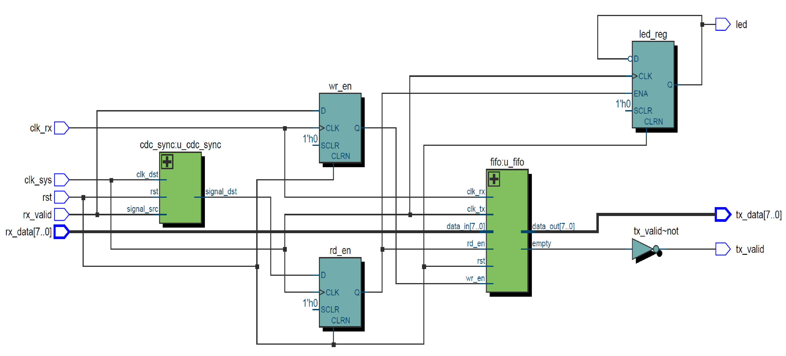
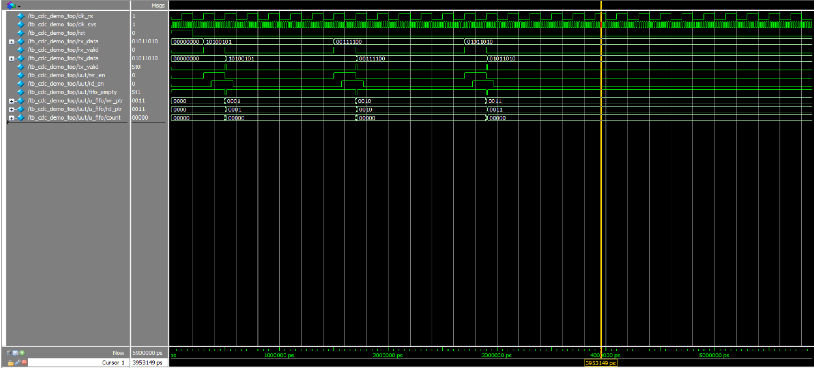

# UART CDC Demo

This project demonstrates a simple UART data synchronization across different clock domains using CDC (Clock Domain Crossing) techniques with FIFO buffering. A LED toggles every time new data is read.

## 📁 Project Structure

| File | Description |
|:----|:------------|
| `cdc_demo_top.v` | Top module connecting CDC sync, FIFO, and control logic |
| `cdc_sync.v` | Two-stage flip-flop CDC synchronizer |
| `fifo.v` | Asynchronous FIFO with separate write and read clocks |
| `tb_cdc_demo_top.v` | Testbench for simulation |
| `RTL_cdc_demo_top.png` | RTL Block Diagram |
| `wave_tb_cdc_demo_top.png` | Simulation waveform |

---

## 📷 RTL Block Diagram

---

## 📈 Simulation Waveform

The following waveform shows:
- RX side sending data (`rx_data`, `rx_valid`)
- FIFO buffering
- TX side reading and outputting (`tx_data`, `tx_valid`)
- LED toggling after every read

---

## 🔧 How It Works

- **RX Clock Domain**:
  - Data (`rx_data`) and valid signal (`rx_valid`) are generated.
  - `rx_valid` is passed through a CDC synchronizer.

- **CDC Synchronization**:
  - `cdc_sync.v` synchronizes `rx_valid` to TX clock domain.

- **FIFO**:
  - Write to FIFO when `rx_valid` is high.
  - Read from FIFO when `rx_valid_sync` is detected.

- **TX Clock Domain**:
  - Data from FIFO is sent to `tx_data`.
  - `tx_valid` indicates data ready.
  - LED toggles on each read.

---

## 💡 Notes
- Design uses simple two-stage flip-flop for CDC, suitable for single-bit control signals.
- FIFO is a dual-clock FIFO allowing asynchronous clock domains.
- Fully synthesizable and simulation verified using ModelSim.

---

## 🛠️ Tools
- **Simulation**: ModelSim Intel FPGA Edition 10.5b
- **Design**: Quartus Prime Lite Edition 18.0
- **Language**: Verilog HDL
